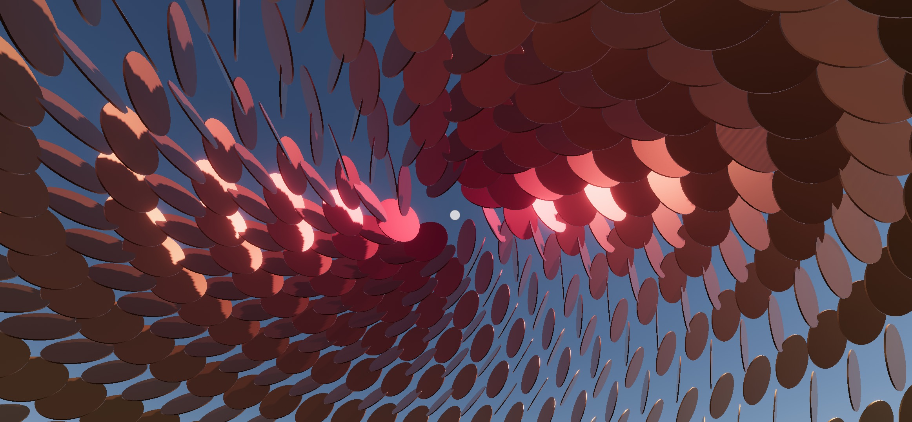
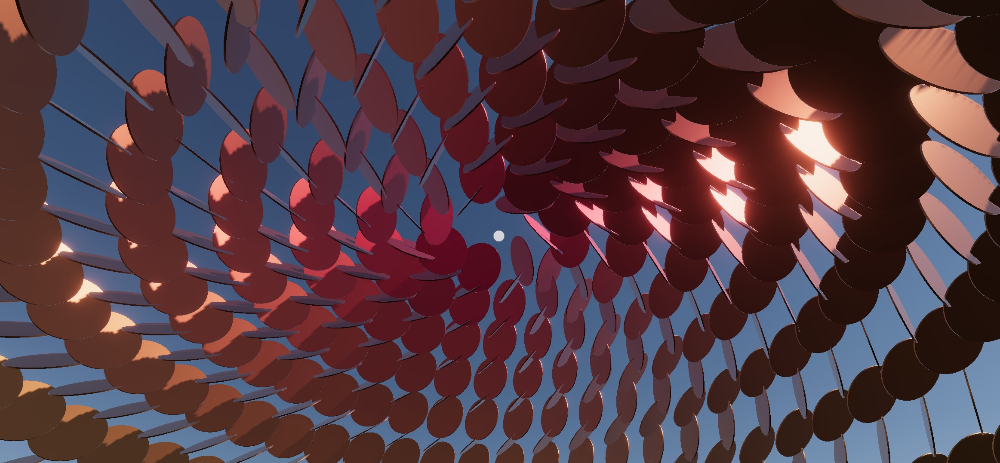

# FlashDome

**"FlashDome" is a generative, (interactive, multi-user) architecture**
aka a place perfect for FlashMobs. 
The architecture is like a giant "canvas" that reacts to all the users presence, movements, and possibly other interactions

the _interactive_ and _multi-user_ parts will come in the future

author: @lyricalpolymath - b25zero1@gmail.com

 
<!---->

 

## Why / Motivation 
1 - at the beginnig  DCL will have few users, **we need places and events that give a reason to users to gather around and play together**, this is meant to be one of them, either permanent, or spot on as the place to organize collective gatherings and flash mob events

2 - Everyone is building for their own land or district...possibly no-one is thinking about **content for the public places**.

3 - This interactive dome could be used also for the **spawning places**, as it reacts to new users presence, making the experience of entering Decentraland fun and beautiful, as well as helping others identify from afar that a new user has joined

## Vision
- the dome for user spawning or as a flashMob event container should be beautiful, emotional and playful

- each spawning dome could and should be **visually different from one another, with different tiles, different dome shapes, and different animating systems**

- the dome should **respond mainly to the presence and actions of the users under it**: the dome should behave like a **"giant collaborative canvas"**

- a dome for a flashMob could have a **"DJ Mode"**, whereas certain users can be given access to manipulating live the parameters of the generative dome, turning it into a full customizable disco-like environment, where each controller can infuse their personality to the architecture, along with the inputs given by user participation

- there is an opportunity to **invite different artists to create each spawning dome**, or a specific flash-mob dome, for a time period or for specific events. 

- The code architecture should enables a fast, simple and modular way of creating these generative domes (this is mostly done)

## Proof of Concept
Right now the scene isn't very interactive, it's a proof of concept and a working code architecture
that will enable quick experimentation with generative content.

### Current dome features:
- a basic demo of a generative geodesic dome
- two different tiles to chose from (a squared plane, and a circular flat tile)
- some basic customizable animating systems (currently non-interactive)
- one (incomplete/bugged and therefore inactive) interactive system that responds to user's camera.position
- a **code architecture** that makes it easy to quickly experiment with generative content, creating custom dome shape generators, tiles and animating systems
- the Dome can be deployed and customized to any number of underlying parcels (change the parcel sizes in [DomeSettings](src/components/flashdome/domeSettings.ts)) as there is currently no way to dynamically detect it from the scene

### Missing / Upcoming features
- There are **no in-scene tools to change the parameters**, those will be done with the **UI elements**, and constitute the basic DJ Mode.
Therefore most of the parameters can today be tweaked only in the code, either in 
-- DomeSettings `src/components/flashdome/domeSettings.ts` 
-- or in the generator settings `S` object at the top of each dome generator (eg `src/components/flashdome/generators/circles1Gen.ts`)

- as mentioned **the only interactive system (that responds to camera.position) is not fully functional yet**
and it will be added possibly after the end of the hackaton
`src/components/flashdome/systems/proximityScaler.ts`

- **multi-user** features will be added once a single user-interactive system will work

- **DJ mode** will create a way to authorize certain users to control the dome in scene UI dashboard that will enable the controller to tweak the parameters of the generative dome

- **more generators and tiles** (there is a hint at a Fibonacci generator that I didn't have time to finish for the hackaton, and we need to explore what it looks like to use 3d models as tiles)...possibly **generators that allow for different types of tiles in the same dome**

